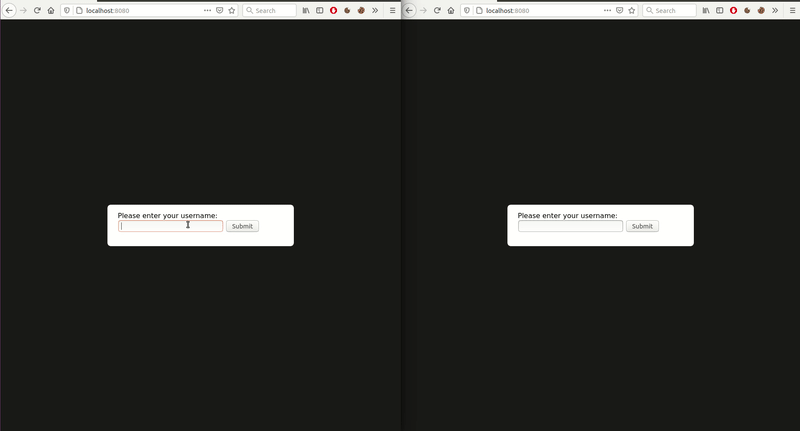

# charybdis-demo
A chat application showcasing the use of Cassandra (and ScyllaDb) in Spring Boot using the ORM framework [Charybdis](https://github.com/omarkad2/charybdis). 



## Data Modeling
In Cassandra/ScyllaDb writes are fast, thus we tend to denormalize a lot and allow ourselves to have redundant data in different tables to have optimal read operations.

Therefore, in this application we have the following tables:
- **user:** Stores info about chat application users (id, username...)
- **chatroom:** Stores data about different chat rooms (id, participants, ...)
- **chatroom_by_code:** Denormalization of table *chatroom*, references chatrooms with a unique code computed by hashing participant ids.
- **message:** Stores different chat rooms messages and their content.
- **message_by_chatroom:** Denormalization of table *message*, references messages with chat room id. 
 
## Running locally
The simplest way to start the application, is to run it with docker: 
```
git clone https://github.com/omarkad2/charybdis-demo.git
cd charybdis-demo
docker-compose up --build
```
This will start a single node cassandra cluster, build the spring boot application and run it.

At startup, the application will create keyspace, tables and indexes if missing. All you have left to do is go to [http://localhost:8080](http://localhost:8080) , you can open as many tabs as many users you
want to have in your chat application.

